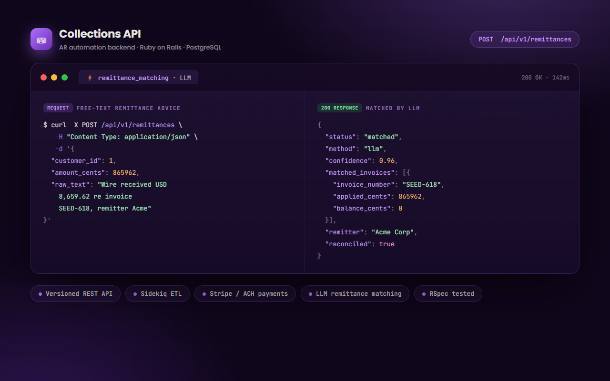
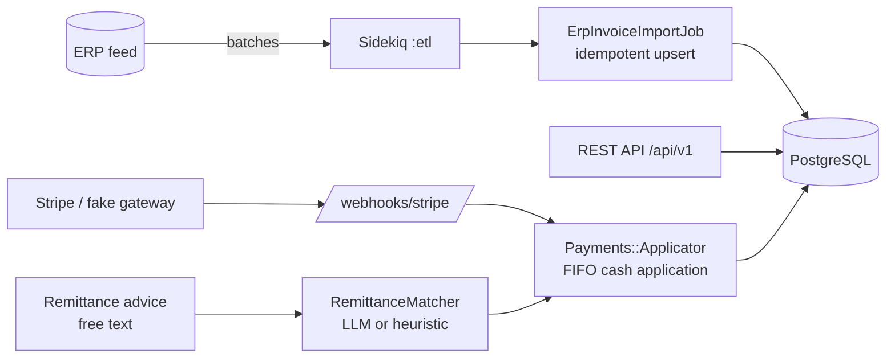

<!-- ══════════════════════════ TITLE ══════════════════════════ -->
<div align="center">
  
</div>

<!-- ══════════════════════ IDIOMAS / LANGUAGES ══════════════════════ -->
<div align="center">
<a href="README.md"></a>
<a href="README.en.md"></a>
<a href="README.es.md"></a>
</div>

<h1 align="center">Collections API</h1>
<p align="center"><em>Accounts-receivable and collections automation for the distribution industry</em></p>
<p align="center"><strong>ERP → idempotent import → FIFO cash application → LLM remittance matching</strong></p>

<div align="center">


</div>

<div align="center">
<a href="#why-this-project"></a>
<a href="#architecture"></a>
<a href="#tech-stack"></a>
<a href="#api"></a>
<a href="#usage"></a>
</div>

<br/>

> 🔗 **Live dashboard (front-end):** [collections-dashboard-beta.vercel.app](https://collections-dashboard-beta.vercel.app) — [source](https://github.com/geoggrigori/collections-dashboard)

<div align="center">
  
</div>

## Why this project

Distributors run on thin margins and slow cash cycles. The hard problems are not CRUD — they are: keeping AR in sync with the ERP at scale, applying cash to the right invoices, and turning messy human remittance notes ("paying invoices 1001 and the March one") into clean ledger entries. This codebase models those problems end to end.

Built with **Ruby on Rails 7 (API-only) + PostgreSQL + Sidekiq + Redis**, with optional **Stripe** and **LLM** integrations that degrade gracefully so the whole thing runs locally with zero external credentials.

## Architecture



**Layers:**
- **Domain models** — `Customer`, `Invoice`, `Payment`, `PaymentApplication`, `Remittance`, with money in integer cents, enums, and business rules (balances, credit limits, allocation).
- **Versioned REST API** (`/api/v1`) — consistent JSON envelope, pagination (pagy), filtering, and structured error handling.
- **ETL pipeline** — a simulated ERP feed enqueues batches to Sidekiq; `ErpInvoiceImportJob` upserts idempotently by `[customer_id, invoice_number]`.
- **Payments** — `Payments::Gateway` wraps Stripe (ACH/card) with a deterministic fake fallback; `Payments::Applicator` does FIFO cash application inside a locked transaction.
- **LLM remittance matching** — `RemittanceMatcher` turns free-text remittance advice into invoice matches via `Llm::Client` (Anthropic or OpenAI), falling back to a deterministic heuristic when no API key is set.

## Tech Stack

| Concern | Choice |
|---|---|
| Language | Ruby 3.3 |
| Framework | Rails 7.2 (API-only) |
| Database | PostgreSQL 16 (indexes, check constraints) |
| Background | Sidekiq 7 + Redis |
| Payments | Stripe (test mode) + fake gateway |
| LLM | Anthropic / OpenAI (pluggable) |
| Pagination | pagy |
| Tests | RSpec + FactoryBot |

## API

All endpoints are under `/api/v1`.

```bash
# Customers (filter by status / name / open balance)
curl "localhost:3000/api/v1/customers?status=delinquent&with_open_balance=true"

# Invoices
curl "localhost:3000/api/v1/invoices?overdue=true"

# Create a payment (Stripe/ACH)
curl -X POST localhost:3000/api/v1/payments -H 'Content-Type: application/json' \
  -d '{"payment":{"customer_id":1,"amount_cents":25000,"payment_method":"ach"}}'

# LLM remittance matching
curl -X POST localhost:3000/api/v1/remittances -H 'Content-Type: application/json' \
  -d '{"remittance":{"customer_id":1,"amount_cents":40000,
       "raw_text":"Payment for invoices INV-R1 and also INV-R3, thanks."}}'
```

On settlement, the payment is applied FIFO across the customer's open invoices. The matcher identifies the referenced invoices (LLM when configured, heuristic otherwise); low-confidence advice is flagged `needs_review`.

**Background jobs:**
```bash
bin/rails 'etl:sync[5000,500]'   # sync 5,000 invoices in batches of 500
bin/rails etl:sweep_overdue      # sweep overdue invoices in one bulk UPDATE
```

## Usage

Requirements: Ruby 3.3, PostgreSQL, Redis.

```bash
bundle install
bin/rails db:prepare          # create + migrate
bin/rails db:seed             # 500 customers, 50k invoices (configurable)
bin/rails server              # http://localhost:3000
bundle exec sidekiq -C config/sidekiq.yml   # background worker
```

Copy `.env.example` to `.env` to enable Stripe and/or an LLM provider. Without them, the fake gateway and heuristic matcher keep everything working.

**Tests:**
```bash
bundle exec rspec
```

**Deployment:** a [`render.yaml`](./render.yaml) blueprint provisions web + worker + PostgreSQL + Redis; a production `Dockerfile` is included.

## License

[MIT](LICENSE).

<div align="center">
  
</div>

<p align="center"><sub>Built by <strong><a href="https://github.com/geoggrigori">Grigori</a></strong> · 2026</sub></p>
