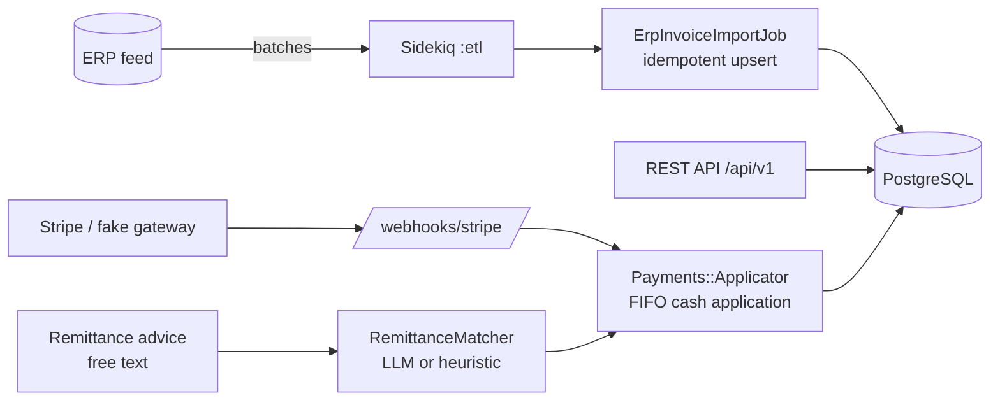

<!-- ══════════════════════════ PORTADA ══════════════════════════ -->
<div align="center">
  
</div>

<!-- ══════════════════════ IDIOMAS / LANGUAGES ══════════════════════ -->
<div align="center">
<a href="README.md"></a>
<a href="README.en.md"></a>
<a href="README.es.md"></a>
</div>

<h1 align="center">Collections API</h1>
<p align="center"><em>Automatización de cuentas por cobrar y cobranza para el sector de distribución</em></p>
<p align="center"><strong>ERP → import idempotente → aplicación de pago FIFO → matching de remesas vía LLM</strong></p>

<div align="center">


</div>

<div align="center">
<a href="#por-qué-este-proyecto"></a>
<a href="#arquitectura"></a>
<a href="#tecnologías"></a>
<a href="#api"></a>
<a href="#uso"></a>
</div>

<br/>

> 🔗 **Dashboard en vivo (frontend):** [collections-dashboard-beta.vercel.app](https://collections-dashboard-beta.vercel.app) — [código fuente](https://github.com/geoggrigori/collections-dashboard)

## Por qué este proyecto

Las distribuidoras operan con márgenes ajustados y ciclos de caja lentos. Los problemas difíciles no son CRUD — son: mantener las cuentas por cobrar sincronizadas con el ERP a escala, aplicar el efectivo a las facturas correctas, y convertir notas de remesa desordenadas ("pagando las facturas 1001 y la de marzo") en asientos contables limpios. Este código modela esos problemas de punta a punta.

Construido con **Ruby on Rails 7 (API-only) + PostgreSQL + Sidekiq + Redis**, con integraciones opcionales de **Stripe** y **LLM** que degradan con gracia — así todo corre localmente sin ninguna credencial externa.

## Arquitectura



**Capas:**
- **Domain models** — `Customer`, `Invoice`, `Payment`, `PaymentApplication`, `Remittance`, con dinero en centavos enteros, enums y reglas de negocio (saldos, límites de crédito, asignación).
- **REST API versionada** (`/api/v1`) — sobre JSON consistente, paginación (pagy), filtros y manejo estructurado de errores.
- **Pipeline de ETL** — un feed de ERP simulado encola lotes en Sidekiq; `ErpInvoiceImportJob` hace upsert idempotente por `[customer_id, invoice_number]`.
- **Pagos** — `Payments::Gateway` envuelve Stripe (ACH/tarjeta) con un fallback falso determinístico; `Payments::Applicator` aplica efectivo FIFO dentro de una transacción con lock.
- **Matching de remesas vía LLM** — `RemittanceMatcher` convierte texto libre de remesa en matches de factura vía `Llm::Client` (Anthropic u OpenAI), cayendo a heurística determinística cuando no hay clave de API.

## Tecnologías

| Aspecto | Elección |
|---|---|
| Lenguaje | Ruby 3.3 |
| Framework | Rails 7.2 (API-only) |
| Base de datos | PostgreSQL 16 (índices, check constraints) |
| Background | Sidekiq 7 + Redis |
| Pagos | Stripe (modo test) + gateway falso |
| LLM | Anthropic / OpenAI (conectable) |
| Paginación | pagy |
| Pruebas | RSpec + FactoryBot |

## API

Todos los endpoints están bajo `/api/v1`.

```bash
# Clientes (filtro por status / nombre / saldo abierto)
curl "localhost:3000/api/v1/customers?status=delinquent&with_open_balance=true"

# Facturas
curl "localhost:3000/api/v1/invoices?overdue=true"

# Crear un pago (Stripe/ACH)
curl -X POST localhost:3000/api/v1/payments -H 'Content-Type: application/json' \
  -d '{"payment":{"customer_id":1,"amount_cents":25000,"payment_method":"ach"}}'

# Matching de remesas vía LLM
curl -X POST localhost:3000/api/v1/remittances -H 'Content-Type: application/json' \
  -d '{"remittance":{"customer_id":1,"amount_cents":40000,
       "raw_text":"Payment for invoices INV-R1 and also INV-R3, thanks."}}'
```

Al liquidar, el pago se aplica FIFO en las facturas abiertas del cliente. El matcher identifica las facturas referenciadas (LLM cuando está configurado, heurística en caso contrario); las remesas de baja confianza se marcan `needs_review`.

**Background jobs:**
```bash
bin/rails 'etl:sync[5000,500]'   # sincroniza 5.000 facturas en lotes de 500
bin/rails etl:sweep_overdue      # barre facturas vencidas en un UPDATE masivo
```

## Uso

Requisitos: Ruby 3.3, PostgreSQL, Redis.

```bash
bundle install
bin/rails db:prepare          # crea + migra
bin/rails db:seed             # 500 clientes, 50k facturas (configurable)
bin/rails server              # http://localhost:3000
bundle exec sidekiq -C config/sidekiq.yml   # worker de background
```

Copia `.env.example` a `.env` para habilitar Stripe y/o un proveedor de LLM. Sin ellos, el gateway falso y el matcher heurístico mantienen todo funcionando.

**Pruebas:**
```bash
bundle exec rspec
```

**Despliegue:** un blueprint [`render.yaml`](./render.yaml) provisiona web + worker + PostgreSQL + Redis; incluye `Dockerfile` de producción.

## Licencia

[MIT](LICENSE).

<div align="center">
  
</div>

<p align="center"><sub>Desarrollado por <strong><a href="https://github.com/geoggrigori">Grigori</a></strong> · 2026</sub></p>
