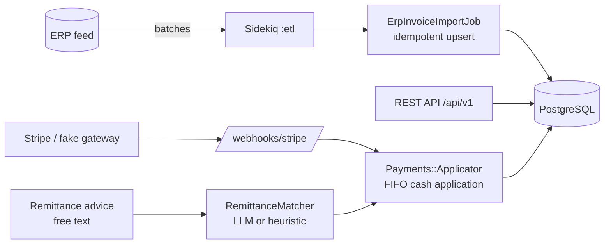

<!-- ══════════════════════════ TÍTULO ══════════════════════════ -->
<div align="center">
  
</div>

<br/>

<!-- ══════════════════════ IDIOMAS / LANGUAGES ══════════════════════ -->
<div align="center">
<a href="README.md"></a>
<a href="README.en.md"></a>
<a href="README.es.md"></a>
</div>

<br/>

<div align="center">


</div>

<div align="center">
<a href="#por-que-esse-projeto"></a>
<a href="#arquitetura"></a>
<a href="#tecnologias"></a>
<a href="#api"></a>
<a href="#uso"></a>
</div>

<br/>

> 🔗 **Dashboard ao vivo (front-end):** [collections-dashboard-beta.vercel.app](https://collections-dashboard-beta.vercel.app) — [código-fonte](https://github.com/geoggrigori/collections-dashboard)

## Por que esse projeto

Distribuidoras trabalham com margens apertadas e ciclos de caixa lentos. Os problemas difíceis não são CRUD — são: manter as contas a receber sincronizadas com o ERP em escala, aplicar o caixa nas faturas certas, e transformar notas de remessa bagunçadas ("pagando as faturas 1001 e a de março") em lançamentos contábeis limpos. Esse código modela esses problemas de ponta a ponta.

**Construído com Ruby on Rails 7 (API-only) + PostgreSQL + Sidekiq + Redis**, com integrações opcionais de **Stripe** e **LLM** que degradam graciosamente — então tudo roda localmente sem nenhuma credencial externa.

## Arquitetura



**Camadas:**
- **Domain models** — `Customer`, `Invoice`, `Payment`, `PaymentApplication`, `Remittance`, com dinheiro em centavos inteiros, enums e regras de negócio (saldos, limites de crédito, alocação).
- **REST API versionada** (`/api/v1`) — envelope JSON consistente, paginação (pagy), filtros e tratamento estruturado de erros.
- **Pipeline de ETL** — um feed de ERP simulado enfileira lotes no Sidekiq; `ErpInvoiceImportJob` faz upsert idempotente por `[customer_id, invoice_number]`.
- **Pagamentos** — `Payments::Gateway` envolve Stripe (ACH/cartão) com fallback determinístico falso; `Payments::Applicator` aplica caixa FIFO dentro de uma transação com lock.
- **Matching de remessa via LLM** — `RemittanceMatcher` transforma texto livre de remessa em matches de fatura via `Llm::Client` (Anthropic ou OpenAI), caindo para heurística determinística quando não há chave de API.

## Tecnologias

| Camada | Escolha |
|---|---|
| Linguagem | Ruby 3.3 |
| Framework | Rails 7.2 (API-only) |
| Banco | PostgreSQL 16 (índices, check constraints) |
| Background | Sidekiq 7 + Redis |
| Pagamentos | Stripe (modo teste) + gateway falso |
| LLM | Anthropic / OpenAI (plugável) |
| Paginação | pagy |
| Testes | RSpec + FactoryBot |

## API

Todos os endpoints estão sob `/api/v1`.

```bash
# Clientes (filtro por status / nome / saldo em aberto)
curl "localhost:3000/api/v1/customers?status=delinquent&with_open_balance=true"

# Faturas
curl "localhost:3000/api/v1/invoices?overdue=true"

# Criar pagamento (Stripe/ACH)
curl -X POST localhost:3000/api/v1/payments -H 'Content-Type: application/json' \
  -d '{"payment":{"customer_id":1,"amount_cents":25000,"payment_method":"ach"}}'

# Matching de remessa via LLM
curl -X POST localhost:3000/api/v1/remittances -H 'Content-Type: application/json' \
  -d '{"remittance":{"customer_id":1,"amount_cents":40000,
       "raw_text":"Payment for invoices INV-R1 and also INV-R3, thanks."}}'
```

Na liquidação, o pagamento é aplicado FIFO nas faturas em aberto do cliente. O matcher identifica as faturas referenciadas (LLM quando configurado, heurística caso contrário); remessas de baixa confiança são marcadas `needs_review`.

**Background jobs:**
```bash
bin/rails 'etl:sync[5000,500]'   # sincroniza 5.000 faturas em lotes de 500
bin/rails etl:sweep_overdue      # varre faturas vencidas em um UPDATE em massa
```

## Uso

Requisitos: Ruby 3.3, PostgreSQL, Redis.

```bash
bundle install
bin/rails db:prepare          # cria + migra
bin/rails db:seed             # 500 clientes, 50k faturas (configurável)
bin/rails server              # http://localhost:3000
bundle exec sidekiq -C config/sidekiq.yml   # worker de background
```

Copie `.env.example` para `.env` pra habilitar Stripe e/ou um provedor de LLM. Sem eles, o gateway falso e o matcher heurístico mantêm tudo funcionando.

**Testes:**
```bash
bundle exec rspec
```

**Deploy:** um blueprint [`render.yaml`](./render.yaml) provisiona web + worker + PostgreSQL + Redis; `Dockerfile` de produção incluso.

## Licença

[MIT](LICENSE).

<div align="center">
  
</div>

<p align="center"><sub>Desenvolvido por <strong><a href="https://github.com/geoggrigori">Grigori</a></strong> · 2026</sub></p>
