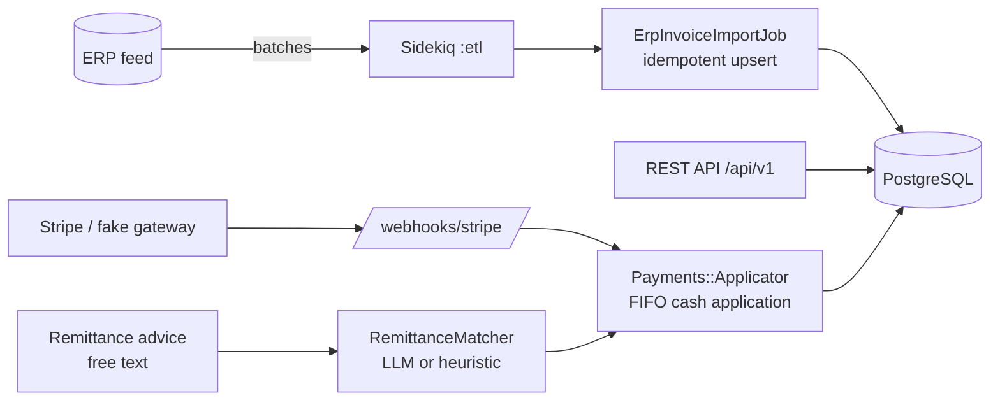

# Collections API

A backend for **accounts-receivable (AR) and collections automation** in the
distribution industry — the kind of system that ingests invoices from ERPs,
reconciles incoming payments, and uses an LLM to match free-text remittance
advice to the right invoices.

Built with **Ruby on Rails 7 (API-only) + PostgreSQL + Sidekiq + Redis**, with
optional **Stripe** and **LLM** integrations that degrade gracefully so the
whole thing runs locally with zero external credentials.

**Live dashboard (front-end) → https://collections-dashboard-beta.vercel.app**
([source](https://github.com/geoggrigori/collections-dashboard))

---

## Why this project

Distributors run on thin margins and slow cash cycles. The hard problems are not
CRUD — they are: keeping AR in sync with the ERP at scale, applying cash to the
right invoices, and turning messy human remittance notes ("paying invoices 1001
and the March one") into clean ledger entries. This codebase models those
problems end to end.

## Architecture



**Layers**

- **Domain models** — `Customer`, `Invoice`, `Payment`, `PaymentApplication`,
  `Remittance`, with money in integer cents, enums, and business rules
  (balances, credit limits, allocation).
- **Versioned REST API** (`/api/v1`) — consistent JSON envelope, pagination
  (pagy), filtering, and structured error handling.
- **ETL pipeline** — a simulated ERP feed enqueues batches to Sidekiq;
  `ErpInvoiceImportJob` upserts idempotently by `[customer_id, invoice_number]`.
- **Payments** — `Payments::Gateway` wraps Stripe (ACH / card) with a
  deterministic fake fallback; `Payments::Applicator` does FIFO cash
  application inside a locked transaction.
- **LLM remittance matching** — `RemittanceMatcher` turns free-text remittance
  advice into invoice matches via `Llm::Client` (Anthropic or OpenAI), falling
  back to a deterministic heuristic when no API key is set.

## Tech stack

| Concern        | Choice                                  |
| -------------- | --------------------------------------- |
| Language       | Ruby 3.3                                |
| Framework      | Rails 7.2 (API-only)                    |
| Database       | PostgreSQL 16 (indexes, check constraints) |
| Background     | Sidekiq 7 + Redis                       |
| Payments       | Stripe (test mode) + fake gateway       |
| LLM            | Anthropic / OpenAI (pluggable)          |
| Pagination     | pagy                                    |
| Tests          | RSpec + FactoryBot                      |

## Getting started

Requirements: Ruby 3.3, PostgreSQL, Redis.

```bash
bundle install
bin/rails db:prepare          # create + migrate
bin/rails db:seed             # 500 customers, 50k invoices (configurable)
bin/rails server              # http://localhost:3000
bundle exec sidekiq -C config/sidekiq.yml   # background worker
```

Seed size is configurable: `SEED_CUSTOMERS=1000 SEED_INVOICES=100000 bin/rails db:seed`.

Copy `.env.example` to `.env` to enable Stripe and/or an LLM provider. Without
them, the fake gateway and the heuristic matcher keep every flow working.

## API reference

All endpoints are under `/api/v1`. Collections are paginated (`page`, `limit`).

### Customers

```bash
# List (filter by status / name / open balance)
curl "localhost:3000/api/v1/customers?status=delinquent&with_open_balance=true"

# Create
curl -X POST localhost:3000/api/v1/customers -H 'Content-Type: application/json' \
  -d '{"customer":{"name":"Acme Distribution","credit_limit_cents":500000}}'
```

Each customer payload includes computed `outstanding_balance_cents` and
`available_credit_cents`.

### Invoices

```bash
curl "localhost:3000/api/v1/invoices?overdue=true"
curl "localhost:3000/api/v1/customers/1/invoices?status=open"
```

### Payments (Stripe / ACH)

```bash
# Create a payment intent (recorded as pending)
curl -X POST localhost:3000/api/v1/payments -H 'Content-Type: application/json' \
  -d '{"payment":{"customer_id":1,"amount_cents":25000,"payment_method":"ach"}}'

# Settle it (demo only; in production this arrives via the Stripe webhook)
curl -X POST localhost:3000/api/v1/payments/1/settle
```

On settlement, the payment is applied FIFO across the customer's open invoices,
creating `PaymentApplication` rows and updating each invoice's balance/status.

### Remittance matching (LLM)

```bash
curl -X POST localhost:3000/api/v1/remittances -H 'Content-Type: application/json' \
  -d '{"remittance":{"customer_id":1,"amount_cents":40000,
       "raw_text":"Payment for invoices INV-R1 and also INV-R3, thanks."}}'
```

The matcher identifies the referenced invoices (LLM when configured, heuristic
otherwise), then — if confident — creates a payment and applies it to exactly
those invoices. Low-confidence advice is flagged `needs_review`.

## Background jobs & ETL

```bash
# Enqueue an ERP sync: 5,000 invoices in batches of 500 on the :etl queue
bin/rails 'etl:sync[5000,500]'

# Sweep overdue invoices in one bulk UPDATE
bin/rails etl:sweep_overdue
```

The Sidekiq dashboard is mounted at `/sidekiq` (HTTP basic auth in production via
`SIDEKIQ_USER` / `SIDEKIQ_PASSWORD`).

## Tests

```bash
bundle exec rspec
```

Covers domain rules, FIFO cash application, the remittance matcher, and the
HTTP layer (request specs).

## Deployment

A [`render.yaml`](./render.yaml) blueprint provisions web + worker + PostgreSQL +
Redis. A production `Dockerfile` is included. Set `RAILS_MASTER_KEY` and any
optional Stripe / LLM keys as environment variables.

## License

MIT — see [LICENSE](./LICENSE).
